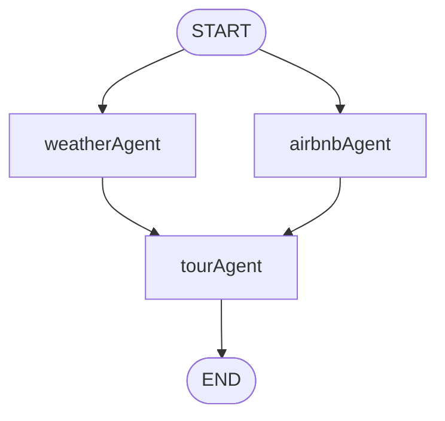

## Tour Agent Implementation (AirbnbAgent/tourAgent.py)

### Overview
This module implements a travel planning assistant that orchestrates multiple agents to produce a final, structured tour plan. It combines:
- An Airbnb hotel search agent powered via MCP (Model Context Protocol)
- A Weather agent with a custom `WeatherForecast` tool
- A final Tour Synthesis agent that merges outputs into a single markdown plan

It uses LangGraph to run the Airbnb and Weather agents in parallel, then streams the synthesized output back to the UI with Streamlit.

### Tech Stack
- **LLM**: `langchain_groq.ChatGroq` (model: `moonshotai/kimi-k2-instruct`, configurable)
- **Agent Orchestration**: LangGraph (`StateGraph`, `create_react_agent`)
- **MCP**: `mcp` client over stdio to `@openbnb/mcp-server-airbnb` (invoked via `npx`)
- **Tools**: LangChain tool (`@tool`) for `WeatherForecast`
- **Streaming**: Streaming Output from Graph
- **Observability**: Langfuse `CallbackHandler`

### Architecture
- **Agents**
  - Airbnb Agent (`airbnbAgent`):
    - Starts an MCP stdio session to `@openbnb/mcp-server-airbnb`
    - Loads MCP tools dynamically with `load_mcp_tools(session)`
    - Creates a ReAct agent with a detailed hotel-search output schema
  - Weather Agent (`weatherAgent`):
    - Exposes a custom LangChain tool `WeatherForecast`
    - Uses WeatherAPI to fetch and format current and forecast data
  - Tour Agent (`tourAgent`):
    - Consumes both agents' outputs (knowledge) and produces a final markdown plan using a strict template

- **Graph Topology (Parallel Execution)**
  - `START` → `weatherAgent`
  - `START` → `airbnbAgent`
  - `weatherAgent` → `tourAgent`
  - `airbnbAgent` → `tourAgent`
  - `tourAgent` → `END`

Both `weatherAgent` and `airbnbAgent` are triggered from `START`, allowing LangGraph to schedule them concurrently. The `tourAgent` node executes after both upstream results are available.



### MCP Integration (Airbnb Search)
- Uses stdio transport to run the MCP server via Node:
  - Command: `npx -y @openbnb/mcp-server-airbnb --ignore-robots-txt`
- Client lifecycle:
  1. Create `StdioServerParameters`
  2. Create stdio client and `ClientSession`
  3. `initialize()`
  4. `load_mcp_tools(session)` to expose available MCP tools to the agent
- The ReAct agent is prompted with an opinionated, structured hotel listing format for consistent outputs.

### Weather Tooling
- `@tool("WeatherForecast") get_forecast(location: str, days: int = 3)`
  - Calls WeatherAPI `forecast.json` endpoint
  - Formats a concise report via `extract_weather(data)` including current conditions and multi-day forecast
  - Returns a string summary for the agent to consume

Minimal usage pattern inside `weatherAgent`:
```python
weather_agent = create_react_agent(
    model=llm,
    tools=[get_forecast],
    prompt="You are a Weather Assistant..."
)
result = weather_agent.invoke({"messages": [{"role": "user", "content": state['topic']}]})
```

### Final Synthesis (Tour Plan)
- `tourAgent` composes a detailed travel plan by:
  - Reading user query `state['topic']`
  - Reading upstream knowledge from Airbnb and Weather agents `state['knowledge']`
  - Applying a strict markdown template `touragentprompt` for deterministic structure

### Streaming in Streamlit
- `sync_app(...)` runs the compiled graph and streams only `tourAgent` node deltas to the UI:
  - Uses `app.astream_events(..., version="v2")`
  - Filters events by `event == "on_chat_model_stream"` and `metadata.langgraph_node == "tourAgent"`
  - Accumulates `chunk` content and renders incrementally via `text_placeholder.markdown(full_text)`

This provides low-latency feedback as the final plan is generated.

### Parallel Execution in LangGraph
- Achieved by connecting `START` to both `weatherAgent` and `airbnbAgent`.
- LangGraph schedules both nodes concurrently when inputs are available and there are no dependencies between them.
- `tourAgent` depends on both and runs once both complete, enabling a classic fan-out/fan-in pattern.

### State, Types, and Checkpointing
- Typed state: `ArticleResponse` with keys `topic`, `summary`, and `knowledge`
- Checkpointer: `InMemorySaver()` used when compiling the graph

### Configuration and Secrets
- `GROQ_API_KEY`: Loaded from `st.secrets["GROQ_API_KEY"]`
- `WEATHER_API_KEY`: Read from process environment `os.getenv("WEATHER_API_KEY")`
- Node/NPX is required at runtime for the MCP Airbnb server

### UI Entry Point
- `tourChat()` provides a chat-like Streamlit UI:
  - Requires `st.session_state['logged_in']`
  - Maintains `tour_agent_messages` session state
  - On user prompt, invokes `sync_app(...)` and appends streamed assistant output to history

### Error Handling and Timeouts
- Weather requests use `timeout=10` and catch `requests.RequestException`
- Streaming loop yields small `await asyncio.sleep(0.01)` to push UI updates smoothly

### Extensibility
- Add new upstream agents: connect `START` → `newAgent` and feed its output into `tourAgent`
- Swap LLMs: change `model_name` or the `llm` provider
- Add more MCP servers: start additional stdio sessions and load their tools into a unified ReAct agent or separate nodes

### Limitations
- MCP server requires Node and network access; error surfaces if unavailable
- WeatherAPI key is mandatory for weather features
- In-memory checkpointing is ephemeral; use durable storage for production

### Quickstart
1. Ensure secrets and env vars:
   - `st.secrets["GROQ_API_KEY"]`
   - `WEATHER_API_KEY` in environment
2. Install Node.js (for `npx`) and Python deps.
3. Run the Streamlit app and open the Tour Chat feature.
4. Ask for a trip plan (e.g., "Plan a 3-day trip to Tokyo next month, 2 adults").


